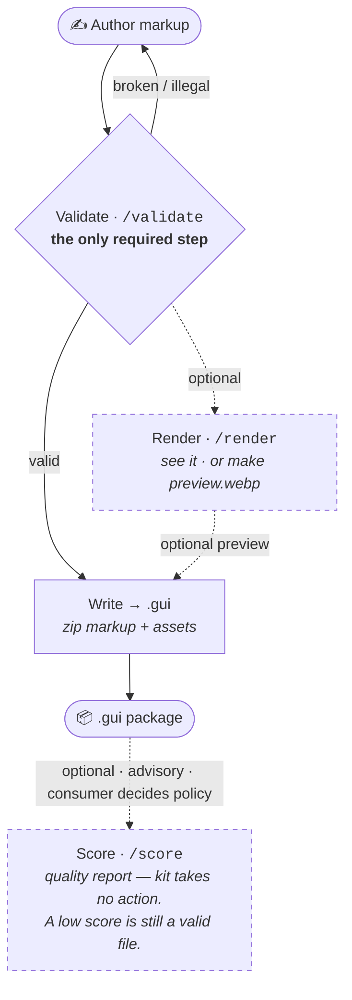
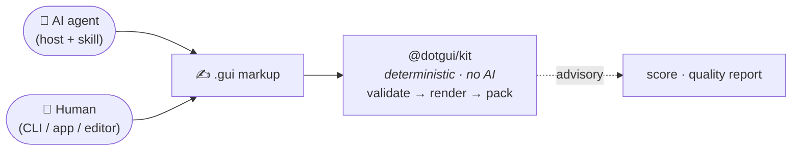

# @dotgui/kit

**The dotgui engine in one package.** Everything required to take a `.gui` file
through its entire life — parse, validate, render, score — lives here, behind one
version and one install.

```bash
bun add @dotgui/kit
```

---

## What it is

A `.gui` file is markup. On its own it's inert: bytes that mean nothing until
something can read them, check them, draw them, and judge them. `@dotgui/kit` is
that something — the **reference engine** for the format.

It is a **pure, deterministic library**. Same input → same output, every time.
There is **zero AI in this package.** The kit doesn't generate designs, guess
intent, or call a model. It executes the format's rules and nothing else. That
separation is deliberate (see *Where the AI lives* below).

If the format's *meaning* depends on it, it's in the kit. If it's a product built
*on top* of the format (exporters, hosted services, editors), it isn't.

---

## The lifecycle of a `.gui` file

The kit is organized around the life of a single file. Two paths:

### Write path — creating a file



**Only validate is required.** Everything else is à la carte — a tool that just
needs to produce a `.gui` pulls `validate`, then writes valid markup (+ assets) to
a zip. Render and score are capabilities you reach for *if you need them*, not
gates you must pass through.

1. **Validate** — *is this broken?* The one hard check. Illegal/unparseable markup
   can't be saved as a real `.gui` — fix it and retry. The format's equivalent of
   a browser rejecting malformed code.
2. **Write / pack** — bundle valid markup (+ assets) into a `.gui`. Minimal output
   needs nothing but valid markup. *(This package I/O — read/write/pack/unpack,
   asset add/rm, set-preview — is the kit's `package` surface: deterministic file
   operations every tool reuses. It currently lives in the CLI and is the next
   consolidation target; see ARCHITECTURE.md.)*
3. **Render** *(optional)* — *what does it look like?* The HTML render is the
   format's reference output. Also feeds the `preview.webp`; the kit rasterizes
   via `puppeteer-core` by default (opt into full `puppeteer` for a bundled
   Chromium), falling back to a placeholder preview if no browser is found. See
   [rasterize](src/rasterize/README.md).

**Score is not a mandatory step in packing.** Packing a valid file never requires
a score. Score is a separate, read-only quality lens you can run on any valid file
— it returns a CCACT report (Clean · Consistent · Accessible; Conventional and
Trend are NA until the corpus exists) and **the kit itself takes no action on it.**
A low score is still a valid, packable file. Think HTML *best-practice standards*
— advisory, not a parser error.

**What happens with the score is entirely the author's call.** The kit only
produces the number; the consuming tool decides the policy. A CLI might fail a
build below a threshold; the app might show a warning badge; a batch job might
auto-discard known-bad output; another tool might just log it and move on. The kit
hands you a measurement and stays out of the way — it never imposes a gate of its
own.

### Read path — consuming a file

```
.gui bytes  →  parse  →  render
               ─────     ──────
               /parser   /render
```

Parse resolves tokens, styles, and modes into a normalized model; render turns
that model into HTML. That's the whole round trip.

---

## What's inside (subpath exports)

The root exports only the canonical **types**. Behaviour lives in subpaths, so a
consumer only bundles what it imports — import the parser and you don't pull in
the renderer.

Each module has its own README with the full API, examples, and use cases —
linked below.

| Import | What it does | Docs |
|---|---|---|
| `@dotgui/kit` | canonical types for the format | [types](src/schema/README.md) |
| `@dotgui/kit/validate` | `validate(markup)` → schema errors, or clean | [validate](src/schema/README.md) |
| `@dotgui/kit/parser` | `parseXml(markup)` → resolved model (tokens/styles/modes resolved) | [parser](src/parser/README.md) |
| `@dotgui/kit/render` | `render(...)`, `renderToHTML(...)` → HTML (browser-clean) | [render](src/render/README.md) |
| `@dotgui/kit/score` | `score(...)`, `scorePackage(...)` → CCACT report | [score](src/score/README.md) |
| `@dotgui/kit/package` | `unpack`/`pack` + read/edit a `.gui` in memory | [package](src/package/README.md) |
| `@dotgui/kit/lint` | `lintMarkup(...)` → idiom + content findings | [lint](src/lint/README.md) |
| `@dotgui/kit/autofix` | `autofixMarkup(...)` → deterministic repair | [autofix](src/autofix/README.md) |
| `@dotgui/kit/rasterize` | `rasterize`/`renderPreview` → image / `preview.webp` | [rasterize](src/rasterize/README.md) |

### Examples

```ts
import { validate } from '@dotgui/kit/validate'
import { renderToHTML } from '@dotgui/kit/render'
import { score } from '@dotgui/kit/score'

const result = validate(markup)        // legal?
const html   = renderToHTML(model)     // what does it look like?
const report = score(markup)           // how good is it?
```

---

## Optimizer (injected) & rasterizer (default in-kit)

- **`optimize`** (Clean's diff signal) — **injected**. The optimizer is a
  separate, not-yet-stable package, so the kit doesn't depend on it. Pass it into
  `score`:

  ```ts
  import { optimize } from 'gui-optimizer'
  score(markup, { optimize })   // Clean scored fully
  score(markup)                 // Clean reported NA — absent with a reason, never faked
  ```

- **rasterizer** (`render` → `preview.webp`) — **shipped, with a default**. The
  kit rasterizes via `puppeteer-core` (a *light* install — no bundled Chromium —
  that drives a system browser). Opt into full `puppeteer` with
  `DOTGUI_PUPPETEER=full` for a self-contained Chromium. No browser found →
  placeholder `preview.webp` + a console error, never a hard failure. Full design
  and limitations: [rasterize](src/rasterize/README.md).

The kit stays pure and light; heavy or
volatile machinery is the consumer's choice.

---

## Where the AI lives (spoiler: not here)

AI — when it's involved at all — lives at **one place only: authoring the
markup.** And authoring is author-agnostic: the `.gui` can be written by an AI
agent *or* by a human using tools (the CLI, the app, an editor). The kit sits
entirely downstream and never knows, or cares, which one produced the file.



Everything to the right of the markup is pure and deterministic. Keeping the kit
AI-free means its behaviour is reproducible and testable, and the quality report
means the same thing no matter who — or what — wrote the file. The agent (or
person) generates; the kit just runs the rules.

---

## Who consumes it

Everything that touches `.gui` files is a thin consumer of this one engine:

| Consumer | Uses | Role |
|---|---|---|
| `@dotgui/cli` | parser · validate · render · score · package · lint · autofix · rasterize | command-line workflow; the AI-free deterministic toolchain |
| `gui-app` | render · validate · package · lint · autofix | the standalone app — authoring + the preview grid |
| `gui-figma` | parser · render | Figma plugin (import/round-trip) |
| `gui-landing` | render | marketing site live previews |
| `dotgui-vscode` | (planned) validate · render | editor diagnostics + preview |
| `gui-tools` *(future)* | render → PNG/JPG/PDF/SVG | export platform; more output formats on the same engine |

Each one imports the kit and stops reimplementing the engine. A fix to the parser
or renderer ships once, atomically, to all of them — no version cascade.

---

## Design principles

- **One package, one version.** The engine pieces are tightly coupled and move
  together. No internal version drift.
- **Subpath exports + tree-shaking.** Use one slice, ship one slice.
- **Sensible defaults, swappable.** The rasterizer ships a `puppeteer-core`
  default (light install) you can upgrade to full `puppeteer` or override; the
  optimizer (unstable) is injected. Defaults work out of the box; nothing heavy is
  forced.
- **HTML is the reference output.** Other formats are derived, and live outside
  the kit.

See [`../ARCHITECTURE.md`](../ARCHITECTURE.md) for the full consolidation decision
and rationale.
